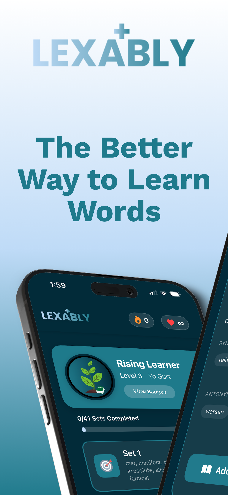
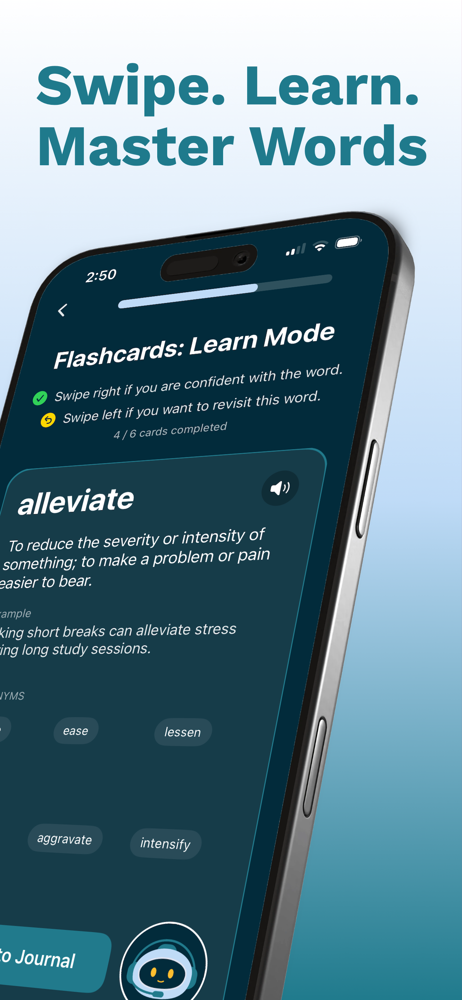
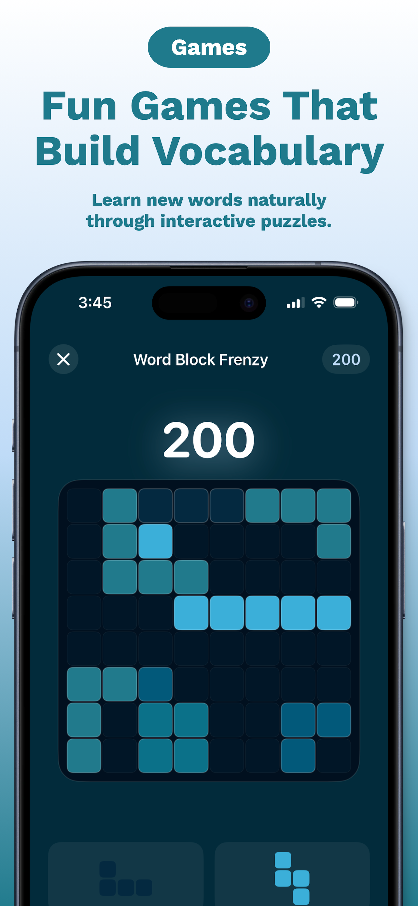
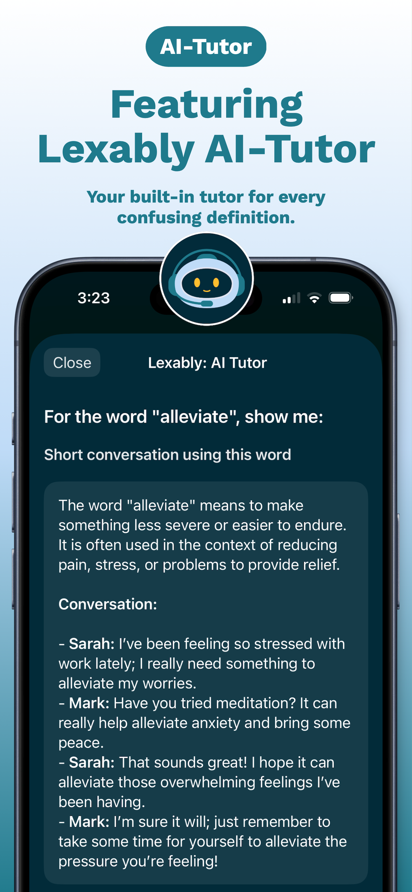
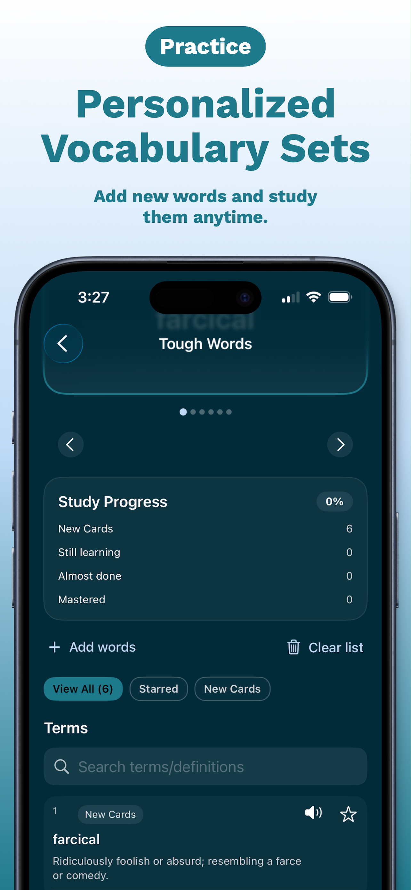

<h1> SAT Vocab & Games: Lexably</h1>

<strong>Flashcards, Quizzes, SAT Words</strong>

  
  
  
  
  
  

---

Lexably is an all-in-one vocabulary app built to help you learn words faster, remember them longer, and actually use them with confidence. Whether you're prepping for the SAT, sharpening academic writing, or just want to sound more articulate, Lexably blends smart flashcards, engaging games, and an AI tutor into a single learning experience. It's built around how memory actually works, using spaced repetition and active recall instead of flat memorization.

Flashcards adapt to you: each card comes with clear definitions, real-world examples, synonyms/antonyms, and audio pronunciation, and Lexably automatically prioritizes the words you struggle with. When something doesn't click, the built-in AI Tutor breaks it down with simpler explanations, usage tips, and better word alternatives, like having a vocabulary coach on call. From there, multiple practice modes (multiple-choice, fill-in-the-blank, synonym/antonym challenges, free response) and fast-paced vocabulary games turn studying into something closer to play.

Beyond test prep, Lexably lets you build your own word lists, save entries to a personal Vocabulary Journal, and track progress through study streaks, mastery stats, and completion tracking. It's built for students prepping for standardized tests, English learners, and anyone who wants a stronger, more confident vocabulary.

**[View on the App Store →](https://apps.apple.com/us/app/sat-vocab-games-lexably/id6755205891)**
